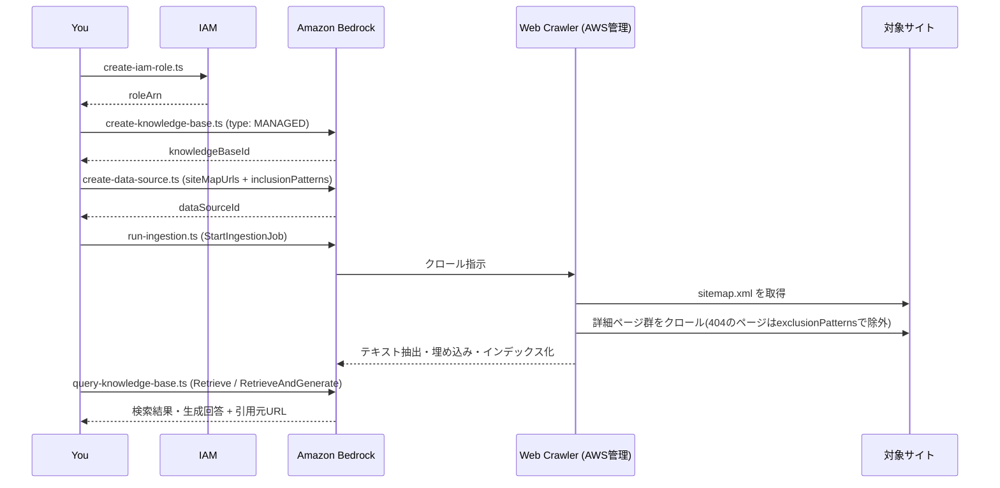

# 01. Knowledge Base(Amazon Bedrock Managed Knowledge Base + Web Crawler)

**難易度: Beginner | 所要時間目安: 20分**

対象サイトの詳細ページ群をWeb Crawlerで取り込み、Amazon Bedrock **Managed Knowledge Base**(2026年6月GAの新サービス)でRAG検索できるようにする。

Managed Knowledge Baseは、埋め込み、再ランキング、ベクトルストアをすべてAWSが管理する新しいKBタイプ。
Customer-managed Knowledge Base(自前でOpenSearch ServerlessやS3 Vectorsを用意する従来型)と異なり、**ベクトルストアの作成もチャンク戦略の選択も不要**で、IAMロールとデータソースを用意するだけで使い始められる。

> **データの実態について:** クロール対象サイトによっては、具体的な数値に乏しいページが多く含まれる。
> グラフ化のデモに向くのは、共通モデルの実数値(価格、実績値など)を複数ページが持つ場合であり、そうしたページ群を選んで `README_INTERNAL.md` の「[Seed URLs](#seed-urls)」`chartDemoCandidateUrls` に登録しておくと、[02. chart_agent](../02_chart_agent/README.md) のデモがそのまま機能する。

> **注意:** このモジュールのスクリプトは実際にAWSリソース(IAMロール、Knowledge Base、データソース)を作成し、Ingestion実行時に課金が発生する。
> 実行前に対象AWSアカウントとリージョンを確認すること。

## Process Overview



## Prerequisites

1. `aws login` でサインイン済みで、対象アカウントとリージョン(既定: `ap-northeast-1`)にアクセスできること(詳細はルート[README](../README.md#quick-setup)参照)
2. リージョンでAmazon Bedrockのモデルアクセスが有効化されていること(埋め込みはManaged KBが自動選択するため意識不要。生成テストには `jp.anthropic.claude-sonnet-4-6` を使用)
3. Managed Knowledge Baseが利用可能なリージョンであること(Tokyo/`ap-northeast-1`を含む主要リージョンで利用可能)
4. ルートディレクトリで `npm install` を実行済みであること

## File Structure

```
01_knowledge_base/
├── README.md                  # このファイル(Seed URLs / Sample Queriesの雛形を含む)
├── README_INTERNAL.md         # (要作成・gitignore) 対象サイト固有のURL・クエリ・実行例
├── seed-urls.ts                # URL一覧のローダー(README_INTERNAL.mdを読み込む)
├── create-iam-role.ts         # Managed KBサービスロール作成
├── create-knowledge-base.ts   # Managed Knowledge Base作成
├── create-data-source.ts      # Web Crawlerデータソース作成
├── run-ingestion.ts           # Ingestionジョブ実行 + 完了待ち
├── query-knowledge-base.ts    # Retrieve / RetrieveAndGenerate テスト
├── clean-resources.ts         # リソースの逆順削除
└── .kb-config.json            # (実行時に生成) KB ID/ARN等の状態ファイル
```

> **セットアップ:** クロール対象サイト固有のURL一覧・検索クエリはリポジトリに含まれない(`README_INTERNAL.md` は常に`.gitignore`対象)。
> このファイルをコピーして作成し、「[Seed URLs](#seed-urls)」「[Sample Queries](#sample-queries)」を対象サイトの値に差し替えること。
>
> ```bash
> cp 01_knowledge_base/README.md 01_knowledge_base/README_INTERNAL.md
> ```

## Seed URLs

`seed-urls.ts` が読み込むクロール対象サイトの設定(`README_INTERNAL.md` に同名セクションとして用意する)。

```yaml
catalogDetailUrls:
  - https://example.com/catalogs/sample-page-1
  - https://example.com/catalogs/sample-page-2
brokenDetailUrls: []
chartDemoCandidateUrls:
  - https://example.com/catalogs/sample-page-1
sitemapUrl: https://example.com/sitemap.xml
catalogInclusionPattern: "^https://example\\.com/catalogs/.*"
```

- `catalogDetailUrls`: 詳細ページのURL一覧
- `brokenDetailUrls`: sitemap.xmlには載っているが実体が404なページ(exclusionPatternsで除外する)
- `chartDemoCandidateUrls`: 数値データが豊富で、グラフ生成デモに向いているページ
- `sitemapUrl`: Web CrawlerのシードにするサイトマップURL
- `catalogInclusionPattern`: `siteMapUrls` 経由で取り込む対象を詳細ページのみに絞り込む正規表現

## Sample Queries

`query-knowledge-base.ts` がデフォルトで実行するクエリの一覧(1行1クエリ、`README_INTERNAL.md` に同名セクションとして用意する)。

- 対象サイトのサービスAとサービスBを比較して、それぞれの特徴を教えてください
- サービスAの料金体系を教えてください

## How to use

### Step 1: IAMサービスロールを作成する

```bash
npx tsx 01_knowledge_base/create-iam-role.ts
```

`bedrock.amazonaws.com` を信頼するIAMロールを作成し、ロールARNを `.kb-config.json` に保存する。

### Step 2: Managed Knowledge Baseを作成する

```bash
npx tsx 01_knowledge_base/create-knowledge-base.ts
```

`knowledgeBaseConfiguration.type: "MANAGED"` を指定してKBを作成する。
ACTIVEになるまで自動でポーリングする。

### Step 3: Web Crawlerデータソースを作成する

```bash
npx tsx 01_knowledge_base/create-data-source.ts
```

`siteMapUrls`(`README_INTERNAL.md` の「[Seed URLs](#seed-urls)」`sitemapUrl`)を起点にクロールし、`inclusionPatterns` で対象パス配下のみに絞り込む。

### Step 4: Ingestionを実行する

```bash
npx tsx 01_knowledge_base/run-ingestion.ts
```

`StartIngestionJob` を実行し、`COMPLETE` になるまでポーリングする(数分かかる)。

### Step 5: 検索してみる

```bash
npx tsx 01_knowledge_base/query-knowledge-base.ts
npx tsx 01_knowledge_base/query-knowledge-base.ts "サービスAの料金体系は?" --mode retrieve
```

## Key Implementation Pattern

**`seedUrls`は最大10件までしか指定できない。**
対象サイトの詳細ページが10件を超える場合は、`siteMapUrls` を起点にして `inclusionPatterns` / `exclusionPatterns` で絞り込む(`01_knowledge_base/create-data-source.ts`):

```typescript
dataSourceConfiguration: {
  type: 'MANAGED_KNOWLEDGE_BASE_CONNECTOR',
  managedKnowledgeBaseConnectorConfiguration: {
    connectorParameters: {
      type: 'WEB',
      version: '1',
      connectionConfiguration: {
        siteMapUrls: [SITEMAP_URL], // seedUrls(最大10件)ではなくsiteMapUrls(最大3件)を使う
        authType: 'NO_AUTH',
      },
      filterConfiguration: {
        inclusionPatterns: [CATALOG_INCLUSION_PATTERN], // /catalogs/ 配下のみに絞り込む
        exclusionPatterns: CATALOG_EXCLUSION_PATTERNS,  // sitemap.xml上は存在するが404のページを除外
      },
    },
  },
},
```

**Managed Knowledge Baseはベクトルストア設定が不要**(`01_knowledge_base/create-knowledge-base.ts`):

```typescript
knowledgeBaseConfiguration: {
  type: 'MANAGED',
  managedKnowledgeBaseConfiguration: {
    embeddingModelType: 'MANAGED', // AWSが埋め込みモデルを自動選択・管理
  },
},
// storageConfiguration は指定しない
```

## Usage Example

```bash
$ npx tsx 01_knowledge_base/query-knowledge-base.ts "サービスA、B、Cの料金プランをそれぞれ教えてください"

クエリ: サービスA、B、Cの料金プランをそれぞれ教えてください
回答: サービスAは月額5,000円、サービスBは月額8,000円、サービスCは初期費用20,000円の
従量課金制です...
引用元:
  - https://example.com/catalogs/service-a
  - https://example.com/catalogs/service-b
  - https://example.com/catalogs/service-c
```

> 対象サイトに対する実際の実行結果は `README_INTERNAL.md`(`.gitignore`対象)に控えておくとよい。

複数ページにまたがる情報を1つの回答に統合できている点が、Managed Knowledge Baseの複数ドキュメント検索(および、より高度な複数ホップ推論を行う **Agentic Retriever**)の見せ所になる。

## References

- [Build a managed knowledge base](https://docs.aws.amazon.com/bedrock/latest/userguide/kb-build-managed.html)
- [Web Crawler (Managed Knowledge Base)](https://docs.aws.amazon.com/bedrock/latest/userguide/kb-managed-ds-webcrawler.html)
- [Create a service role for managed Amazon Bedrock Knowledge Bases](https://docs.aws.amazon.com/bedrock/latest/userguide/kb-managed-permissions.html)
- [CreateKnowledgeBase API reference](https://docs.aws.amazon.com/bedrock/latest/APIReference/API_agent_CreateKnowledgeBase.html)

## Next Steps

このKnowledge Baseは [02. chart_agent](../02_chart_agent/README.md) で、価格や実績値といった数値データを検索してグラフ化するエージェントから利用する。

**発展:** 今回は `bedrock-agent-runtime` の `Retrieve` APIを直接呼び出す構成にしたが、Managed Knowledge BaseはAgentCore Gatewayの**ネイティブターゲットタイプ**として公開できる。
Gateway経由にすると、`queryKnowledgeBase` のようなツールを自作せずMCP経由で自動的にツール化される(権限管理とobservabilityも自動)。
興味があれば [Connect to your knowledge base through AgentCore Gateway](https://docs.aws.amazon.com/bedrock/latest/userguide/kb-gateway-target.html) を参照。
