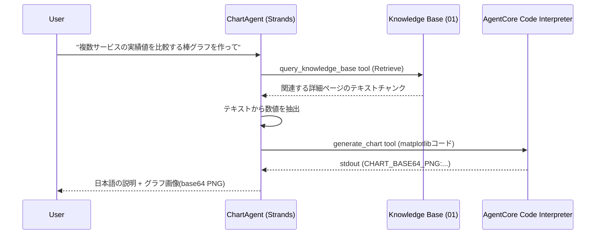

# 02. Chart Agent(Knowledge Base検索 + AgentCore Code Interpreter)

**難易度: Intermediate | 所要時間目安: 20分**

[01. Knowledge Base](../01_knowledge_base/README.md) で構築したManaged Knowledge Baseから数値データ(価格、実績値など)を検索し、Amazon Bedrock AgentCore **Code Interpreter**(サンドボックスPython実行環境)でmatplotlibによるグラフ画像を生成するエージェント。

このモジュールはローカル実行のみを扱う。
AgentCore Runtimeへのデプロイは [03. runtime](../03_runtime/README.md) で行う。

> **題材選びについて:** クロール対象ページの中から、共通モデルの実数値(価格、実績値など)を持つページ群を選ぶと、サービス横断の比較チャートに向く。
> デフォルトのデモクエリは、そうしたページ群を対象にする想定である(選定は `01_knowledge_base/README_INTERNAL.md` の「Seed URLs」`chartDemoCandidateUrls` を参照)。

## Process Overview



## Prerequisites

1. [01. Knowledge Base](../01_knowledge_base/README.md) のセットアップが完了し、`01_knowledge_base/.kb-config.json` に `knowledgeBaseId` が保存されていること
2. `aws login` でサインイン済みで、AgentCore Code Interpreterの利用権限(`bedrock-agentcore:*CodeInterpreter*`)を持つこと
3. ルートディレクトリで `npm install` を実行済みであること

## File Structure

```
02_chart_agent/
├── README.md               # このファイル(Sample Requestの雛形を含む)
├── README_INTERNAL.md      # (要作成・gitignore) 対象サイト固有の依頼内容・実行例
├── chart-agent/
│   ├── config.ts           # システムプロンプト、モデルID
│   └── chart-agent.ts       # ChartAgentクラス: KB検索tool + Code Interpreterグラフ生成tool
├── graph-agent.ts      # ローカル動作確認スクリプト(README_INTERNAL.mdを読み込む)
└── output/                  # (実行時に生成) 生成されたグラフPNG
```

> **セットアップ:** 対象サイト固有のデフォルト依頼内容はリポジトリに含まれない(`README_INTERNAL.md` は常に`.gitignore`対象)。
> このファイルをコピーして作成し、「[Sample Request](#sample-request)」を対象サイトに合わせた依頼文に差し替えること。
>
> ```bash
> cp 02_chart_agent/README.md 02_chart_agent/README_INTERNAL.md
> ```

## Sample Request

> `graph-agent.ts` がデフォルトで実行するグラフ作成依頼の内容(`README_INTERNAL.md` に同名セクションとして用意する)。

対象サイトのサービスAとサービスBの価格帯を比較する棒グラフを作ってください

## How to use

### Step 1: ローカルでエージェントを実行する(引数なし = デフォルトのデモクエリ)

```bash
npx tsx 02_chart_agent/graph-agent.ts
```

デフォルトの依頼内容は `README_INTERNAL.md` の「[Sample Request](#sample-request)」セクションから読み込む(セットアップ時に追加した対象サイト向けの依頼文)。
エージェントが対象ページをKnowledge Baseから検索し、matplotlibコードをCode Interpreterで実行してグラフを生成する。
生成されたPNGは `02_chart_agent/output/chart-<timestamp>.png` に保存される。

### Step 2: 別のクエリで試す

```bash
# 別の切り口で比較する例
npx tsx 02_chart_agent/graph-agent.ts "サービスAとサービスBの累積収益を比較する棒グラフを作って"

# 時系列データを持つページを使った例
npx tsx 02_chart_agent/graph-agent.ts "サービスCの導入1年目と3年目の実績値を比較するグラフを作って"
```

## Key Implementation Pattern

**Code Interpreterはファイルではなく標準出力しか返さないため、画像はbase64テキストとして受け渡す**(`02_chart_agent/chart-agent/chart-agent.ts`):

```typescript
const resultText = await ci.executeCode({ code: input.code, language: 'python' })
const markerLine = (resultText ?? '').split('\n').find((line) => line.startsWith(CHART_MARKER))
if (markerLine) {
  agentSelf.lastChartBase64 = markerLine.slice(CHART_MARKER.length).trim()
}
```

システムプロンプト側でLLMに「`CHART_BASE64_PNG:`プレフィックス付きで1行printする」という出力規約を守らせている(`02_chart_agent/chart-agent/config.ts`)。
サンドボックスに日本語フォントが入っていない可能性があるため、グラフの軸ラベルは英数字にするよう指示している点にも注意。

**`finally`ブロックでCode Interpreterセッションを必ず停止する**(コストとクォータ管理のため):

```typescript
async handleRequest(userRequest: string) {
  try {
    // ...
  } finally {
    await this.cleanup() // 必ずCode Interpreterセッションを停止
  }
}
```

## Usage Example

```
$ npx tsx 02_chart_agent/graph-agent.ts

依頼: サービスA、B、C、D、Eの5つのサービスについて、
実績値を比較する棒グラフを作ってください

--- 回答 ---
5サービスの実績値(モデルケース)を比較する棒グラフを作成しました。
サービスAとサービスCが比較的大きく、サービスBは条件により幅があります。

グラフ画像を保存しました: 02_chart_agent/output/chart-1751520000000.png
```

> 対象サイトに対する実際の実行結果は `README_INTERNAL.md`(`.gitignore`対象)に控えておくとよい。

## References

- [Amazon Bedrock AgentCore Code Interpreter](https://docs.aws.amazon.com/bedrock-agentcore/latest/devguide/code-interpreter-tool.html)
- [Strands Agents ドキュメント](https://strandsagents.com/)
- [Amazon Bedrock Retrieve API](https://docs.aws.amazon.com/bedrock/latest/APIReference/API_agent-runtime_Retrieve.html)

## Next Steps

[03. runtime](../03_runtime/README.md) で、このエージェントをAmazon Bedrock AgentCore Runtimeにデプロイし、HTTPエンドポイント経由で呼び出せるようにする。
