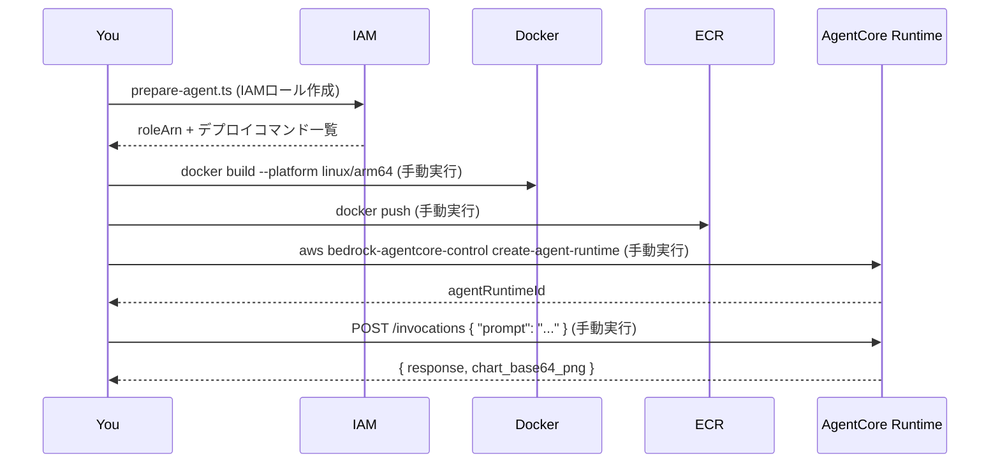

# 03. Runtime(AgentCore Runtimeへのデプロイ)

**難易度: Intermediate | 所要時間目安: 20分**

[02. Chart Agent](../02_chart_agent/README.md) で作成したエージェントをAmazon Bedrock **AgentCore Runtime** にデプロイし、HTTPエンドポイント経由で呼び出せるようにする。

> **注意:** このモジュールの `prepare-agent.ts` はIAMロールの作成のみを実際に実行する。
> `docker build` / ECR push / `create-agent-runtime` はコマンド文字列を表示するだけで自動実行しない。
> 内容を理解しながら、受講者自身の判断で実行すること。

## Process Overview



## Prerequisites

1. [01. Knowledge Base](../01_knowledge_base/README.md) と [02. Chart Agent](../02_chart_agent/README.md) が完了していること
2. Docker Desktop(または互換のコンテナビルド環境)がインストール済みで、`--platform linux/arm64` のクロスビルドに対応していること
3. `aws login` でサインイン済みで、ECRへのpushと `bedrock-agentcore-control` の呼び出しができるIAM権限を持つこと

## File Structure

```
03_runtime/
├── README.md
├── prepare-agent.ts        # IAMロール作成 + デプロイコマンドの表示
├── clean-resources.ts       # Agent Runtime / ECR / IAMロールの削除
└── deployment/
    ├── Dockerfile           # node:24-slim, --platform linux/arm64
    ├── index.ts             # BedrockAgentCoreApp で GET /ping, POST /invocations を実装
    ├── package.json         # コンテナ内で完結する最小限の依存関係
    └── tsconfig.json
```

## How to use

### Step 1: IAMロールを作成し、デプロイコマンドを確認する

```bash
npx tsx 03_runtime/prepare-agent.ts
```

`AgentCoreRole-chart-agent` を作成し、`bedrock:Retrieve` を01のKnowledge Base ARNに限定して付与する。
続けて `docker build` / ECR push / `create-agent-runtime` のコマンドを画面に表示する。

### Step 2: 表示されたコマンドを確認しながら手動で実行する

```bash
# prepare-agent.tsが表示した内容をコピーして実行(リポジトリルートで実行すること)
docker build --platform linux/arm64 -t chart-agent -f 03_runtime/deployment/Dockerfile .
# ... (ECR push, create-agent-runtime と続く)
```

`create-agent-runtime` のレスポンスに含まれる `agentRuntimeId` を控えておく。

### Step 3: エージェントを呼び出す

```bash
aws bedrock-agentcore-control get-agent-runtime --agent-runtime-id <agentRuntimeId>
# invoke-agent-runtime 等でPOST /invocationsを呼び出す
```

### Step 4: 不要になったら削除する

```bash
npx tsx 03_runtime/clean-resources.ts --runtime-id <agentRuntimeId>
```

## Key Implementation Pattern

**BedrockAgentCoreAppがRuntimeのHTTP契約(`GET /ping`, `POST /invocations`)を自動実装する**(`03_runtime/deployment/index.ts`):

```typescript
const app = new BedrockAgentCoreApp({
  invocationHandler: {
    requestSchema,
    process: async (request) => {
      const agent = new ChartAgent({ knowledgeBaseId: process.env.KNOWLEDGE_BASE_ID })
      const result = await agent.handleRequest(request.prompt ?? request.user_input ?? '')
      return { response: result.text, chart_base64_png: result.chartBase64 }
    },
  },
})
app.run()
```

**コンテナ内にはローカル設定ファイル(`.kb-config.json`)が存在しないため、KnowledgeBaseIdは環境変数で渡す**(`02_chart_agent/chart-agent/chart-agent.ts`):

```typescript
this.knowledgeBaseId =
  options?.knowledgeBaseId ??       // 明示的な指定を最優先
  process.env.KNOWLEDGE_BASE_ID ??  // AgentCore Runtimeデプロイ時はこちら
  loadConfig(KB_CONFIG_PATH).knowledgeBaseId // ローカル開発時はこちら
```

`create-agent-runtime` 実行時に `--environment-variables '{"KNOWLEDGE_BASE_ID":"<01で作成したKB ID>"}'` を追加する(または `docker run -e KNOWLEDGE_BASE_ID=...` でローカル検証する)。

**IAMロール作成のみ実行し、破壊的/課金の伴うコマンドは表示だけに留める**(`03_runtime/prepare-agent.ts`):

```typescript
const { roleArn } = await createAgentCoreRole(region) // これは実行する
const deployCommand = buildDeployCommand(region, roleArn)
console.log(deployCommand) // docker build / ecr push / create-agent-runtime は表示のみ
```

## Usage Example

```
$ npx tsx 03_runtime/prepare-agent.ts

IAMロールを作成しました: AgentCoreRole-chart-agent
実行ポリシーをアタッチしました: AgentCoreRole-chart-agent

--- エージェント準備が完了しました ---
Agent Name: chart-agent
Runtime Name: chart_agent
Region: ap-northeast-1
Role ARN: arn:aws:iam::123456789012:role/AgentCoreRole-chart-agent

次のステップ(このスクリプトは実行しません。内容を確認しながら手動で実行してください):

# 1. Dockerイメージをビルドする (AgentCore Runtimeはarm64必須):
docker build --platform linux/arm64 -t chart-agent -f 03_runtime/deployment/Dockerfile .
...
```

## References

- [Amazon Bedrock AgentCore Runtime](https://docs.aws.amazon.com/bedrock-agentcore/latest/devguide/runtime.html)
- [Runtime HTTP protocol contract](https://docs.aws.amazon.com/bedrock-agentcore/latest/devguide/runtime-http-protocol-contract.html)
- [CreateAgentRuntime API](https://docs.aws.amazon.com/bedrock-agentcore-control/latest/APIReference/API_CreateAgentRuntime.html)

## Next Steps

これで研修の一通りの流れ(Managed Knowledge Base構築 → Code Interpreterでのグラフ生成 → AgentCore Runtimeへのデプロイ)を体験できた。
発展課題として、[01のREADME](../01_knowledge_base/README.md#next-steps) で触れたAgentCore Gatewayのネイティブ Knowledge Base ターゲットタイプを使い、`query_knowledge_base` ツールをMCP経由の自動公開に置き換えることに挑戦してみてほしい。
